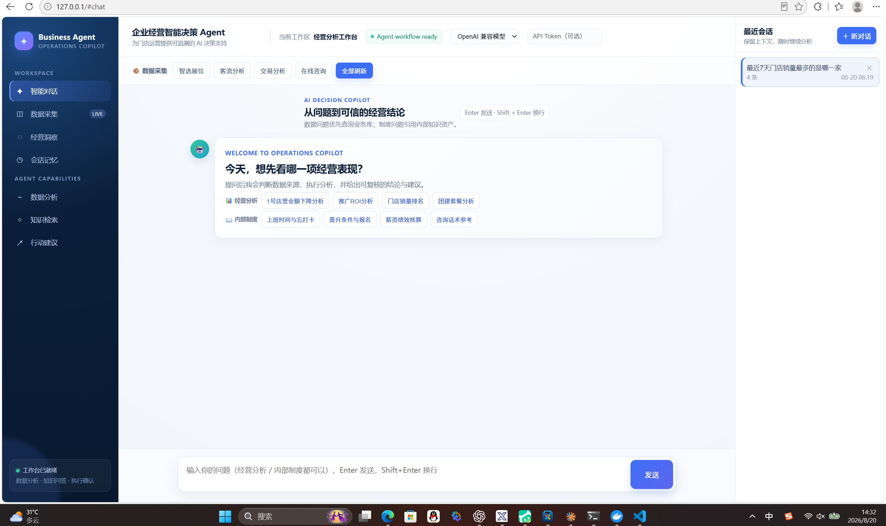

# 企业经营智能决策与店长通知 Agent 系统

> Enterprise Intelligent Decision & Notification Agent — 面向连锁门店的低风险运营闭环
> **数据获取 → 智能分析 → 知识问答 → 问题诊断 → 店长沟通草稿 → 人工确认 → dry-run 或钉钉单聊**

用户只需用自然语言提问，系统自动完成完整闭环。系统具备三类能力：

- 📊 **经营数据分析**：理解意图 → 查询业务数据（MySQL）→ Pandas 指标计算 → 异常归因 → 检索运营知识库 → 生成经营诊断报告
- 📖 **企业内部知识问答**：直接检索知识库（制度/手册/话术/流程）→ 口语化回答
- 💬 **店长通知授权**：仅在用户明确要求时生成可追溯的纯文本沟通草稿；人工确认后默认 dry-run，也可通过 Windows 宿主机已登录的 DWS 以个人身份发钉钉单聊。不修改推广预算。

例如：

> "分析最近 7 天 1 号门店营业额下降原因，并给出优化建议。" → 经营诊断报告
> "我是新员工，每天上班时间是多少，忘记打卡怎么办？" → 知识库口语化回答

---

## 运行预览

首页是经营决策工作台，左侧导航对应独立页面：智能对话、数据采集、知识库管理和会话记忆。`AGENT CAPABILITIES` 下的能力入口也会跳转到对应的可用页面，而不是静态占位文字。



Docker 启动后可直接访问：

```text
http://localhost/             # 智能对话
http://localhost/data         # 数据采集工作台
http://localhost/knowledge    # RAG 知识库上传、切割与入库
http://localhost/sessions     # 历史会话与上下文恢复
```

> Windows 数据采集器不运行在 Docker 中：美团采集依赖宿主机 Edge、CDP 和登录态。Docker 部署时，先用
> `docker compose up -d --build` 启动主服务与 MySQL，再在 Windows 宿主机运行
> `powershell -ExecutionPolicy Bypass -File .\scripts\start_collector.ps1`。
> Collector 监听 `127.0.0.1:8001`，主服务会自动转发“数据采集”按钮请求；Docker MySQL 仅映射到
> `127.0.0.1:3307`，不暴露给局域网。

---

## 一、核心特性

| 特性 | 说明 |
|---|---|
| **可组合 Supervisor** | 经营分析与知识问答为独立子图；通知 Agent 只作为经营分析下游，支持“分析并通知”和同会话“把刚才结果发给店长” |
| **默认走 RAG** | 只有明确的数据类提问才触发工具查询，制度/流程/话术类问题默认走知识问答（避免答非所问） |
| **双 LLM 通道** | DeepSeek 直连（默认）与 CodeBuddy 通道（workbuddy2api 本地代理）并存，一行配置切换 |
| **确定性计算** | 指标由 Pandas 计算，LLM 只做归因解释与报告；意图路由统一判定（`agent/routing.py`，知识词优先，supervisor 与 report 同源） |
| **门店名解析** | "XX店营业额"自动解析为 store_id（`tools/store_resolver.py`，stores.json/DB 主数据模糊匹配），不再让 LLM 猜门店 |
| **混合检索 RAG** | 向量（bge-small-zh-v1.5 / bge-m3）+ BM25（jieba，进程级缓存）→ RRF 融合；父子切割返回上下文（父块独立存储） |
| **多格式知识入库** | 支持 Markdown / TXT / PDF / DOCX / CSV / XLSX 自动切块入库；表格按工作表逐行建立索引并保留表头/行号；上传安全（basename 白名单 + 20MB 上限 + 按文件名幂等） |
| **结构化报告** | data 链路 with_structured_output 输出五段 JSON（摘要/指标/归因/建议/风险），前端直接渲染——告别正则兜底与内部字段泄漏 |
| **真流式 SSE** | `astream_events` 透传子图内 LLM token（kb 链路逐 token 打字机）+ 真实 usage 采集（`on_chat_model_end`） |
| **查询缓存** | 昂贵数据工具 TTL 缓存（60s），`/api/workflow/refresh` 与执行确认后自动失效 |
| **LLM 运行时切换** | 前端下拉即可切换 DeepSeek/CodeBuddy/OpenAI/本地（`POST /api/llm/switch`），无需改 .env 重启 |
| **会话持久化** | 按 session_id 存储对话历史，刷新不丢上下文；支持删除会话、导出对话 |
| **低风险通知闭环** | `AnalysisRun` 保存分析快照；店长通讯录一次性直接导入 `store_contacts`，草稿可编辑、确认、取消，默认 dry-run 且幂等 |
| **钉钉发送边界** | 默认 disabled/dry-run；个人账号 live 走 Windows 宿主机的 DWS CLI，固定收件人并经过人工确认；官方 MCP Python SDK 客户端作为可选适配层，未配置时不建立连接 |
| **可观测性** | request_id 贯穿日志/审计/前端 trace；`GET /api/audit` 只读查询（时间/事件/会话过滤）；错误信息脱敏 |

---

## 二、快速开始

> 代码全部位于项目根目录（无 backend/ 子目录），以下命令均在根目录执行。

```bash
# 1. 创建虚拟环境并安装依赖（Python 3.13）
python -m venv .venv
.venv/Scripts/pip install -r requirements.txt -r requirements-collector.txt  # Windows（含本机 Collector）
# .venv/bin/pip install -r requirements.txt          # Linux/macOS

# 2. 配置环境变量
cp .env.example .env
#   编辑 .env：
#   - BIZ_DB_PASSWORD=<MySQL 密码>          （必填）
#   - BIZ_STORES_JSON=D:\path\stores.json    （门店主数据，可选）
#   - BIZ_LLM_PROVIDER=deepseek|codebuddy    （LLM 通道，见第四节）
#   - BIZ_CONTACT_ENCRYPTION_KEY=<Fernet 密钥>（联系人导入必填；生成命令见下方）

# 3. 建库建表 + 灌入数据（真实门店 37 家 + 订单/推广/市场数据）
.venv/Scripts/python -m scripts.seed

# 4. 启动 LLM 通道（仅 codebuddy 通道需要；DeepSeek 直连可跳过）
#    端口需与 .env 的 BIZ_CODEBUDDY_BASE_URL 一致：8788=远程账号（当前默认）/ 8787=本机账号
cd /d/workbuddy2api && ./start-wb2api-remote.sh start   # 8788 远程账号；本机账号改用 ./start-wb2api.sh start

# 5. 启动服务（首次启动会下载 RAG 嵌入模型，约 90MB，一次性）
.venv/Scripts/uvicorn main:app --reload --port 8000
# 或使用项目脚本（管道方式启动，Windows 子进程兼容）：
# ./start-backend.sh &
# 推荐一键启动（按 .env 自动拉起 LLM 通道 + 后端）：
# ./start-all.sh &

# 6. 验证
curl http://127.0.0.1:8000/health
```

启用联系人导入前，在本机生成一次密钥并写入 `.env`（不要提交该文件）：

```bash
.venv/Scripts/python -c "from cryptography.fernet import Fernet; print(Fernet.generate_key().decode())"
```

**当前状态**：仅真实数据链路——已接入真实 MySQL（`business_agent` 库，37 家密室逃脱真实门店 + 23.3 万订单 + 128 条推广计划 + 客流/交易/咨询市场数据）。**不提供任何 Mock/模拟数据**：LLM 通道未配置时接口会返回明确错误，请先配置 `BIZ_LLM_PROVIDER` 对应通道。

---

## 三、对话调用

### 3.1 前端页面

浏览器打开 `http://localhost/`，内置 8 个示例问题（📊 经营分析 4 个 + 📖 内部制度 4 个），支持 SSE 流式输出（kb 逐 token / data 结构化五段卡片）、KPI 指标卡、LLM 通道下拉切换、会话删除与导出、右上角 API Token 输入。开发环境直接运行 Uvicorn 时也可访问 `http://127.0.0.1:8000/`。

知识库管理页支持拖放或选择 Markdown / TXT / PDF / DOCX / CSV / XLSX 文件。CSV 会自动兼容 UTF-8、GB18030 等常见编码；XLSX 按工作表读取。表格会按行保留工作表、表头、行号和“字段=值”关系，每一行独立建立检索块，再按项目既定父子策略入库：Embedding → Chroma 持久化；页面会显示实际入库 chunk 数和当前文档清单。

### 3.2 API

> 🔐 **鉴权**：`.env` 配置了 `BIZ_API_TOKEN` 后，所有 `/api/*` 接口必须携带请求头
> `Authorization: Bearer <token>`（或 `X-API-Token: <token>`），否则返回 401；
> 未配置时鉴权关闭（开发模式，启动有警告）。前端页面右上角可填写 Token。

```bash
# 普通对话（非流式）
curl -X POST http://127.0.0.1:8000/api/chat \
  -H "Content-Type: application/json" \
  -H "Authorization: Bearer <token>" \
  -d '{"question": "分析最近7天1号门店营业额下降原因并给出优化建议"}'

# 流式对话（SSE：progress/token/done 事件）
curl -N -X POST http://127.0.0.1:8000/api/chat/stream \
  -H "Content-Type: application/json" \
  -H "Authorization: Bearer <token>" \
  -d '{"question": "门店晋升需要什么条件", "session_id": "abc"}'

# 知识库文档或表格上传（md/txt/pdf/docx/csv/xlsx，自动入库）
curl -X POST http://127.0.0.1:8000/api/rag/upload \
  -H "Authorization: Bearer <token>" \
  -F "file=@门店员工手册.pdf" -F "doc_type=hr"

# 数据采集（前端按钮驱动，刷新美团经营数据入库）
curl -X POST http://127.0.0.1:8000/api/workflow/refresh \
  -H "Content-Type: application/json" \
  -H "Authorization: Bearer <token>" \
  -d '{"datasets": "all"}'

# 一次性直接写入数据库；没有联系人上传页面或 HTTP 接口
.venv/Scripts/python -m scripts.import_store_contacts "D:\\path\\店长信息库.csv"

# 用户确认后：默认写 simulated；live + dws_host 时发送到已配置的朱兴福账号
curl -X POST http://127.0.0.1:8000/api/notifications/notice_xxxx/confirm \
  -H "Authorization: Bearer <token>"

# 会话管理
curl http://127.0.0.1:8000/api/sessions \
  -H "Authorization: Bearer <token>"
```

### 3.3 API 端点一览

| 端点 | 说明 |
|---|---|
| `GET /health` | 健康检查（含 LLM 通道/数据模式/数据库状态，公开） |
| `POST /api/chat` | 非流式对话（返回 report + report_sections + `analysis_run_id` + `pending_notifications`） |
| `POST /api/chat/stream` | SSE 流式对话（done 含 `analysis_run_id`、通知草稿和 request_id） |
| `GET /api/sessions` / `POST /api/sessions/{id}` / `DELETE /api/sessions/{id}` | 会话列表 / 指定会话 / 删除会话 |
| `GET /api/sessions/{id}/messages` | 单会话历史消息 |
| `GET /api/rag/documents` | 知识库文件清单、上传规则与切割策略 |
| `POST /api/rag/upload` | 知识库文件上传入库（basename 白名单 + 20MB + 按文件名幂等） |
| `POST /api/workflow/refresh` | 数据采集（智选展位/客流/交易/咨询；成功后数据缓存失效） |
| `POST /api/collector/refresh` | **仅 Windows Collector 内部使用**；Docker 主服务会转发，不由浏览器直接调用 |
| `GET /api/notifications` / `PATCH /api/notifications/{id}` | 通知草稿查询与编辑 |
| `POST /api/notifications/{id}/confirm` / `cancel` | 人工确认后 dry-run 记录 simulated，或按配置调用 DWS；取消后不可再次确认，重复确认幂等 |
| `POST /api/execute/confirm` / `GET /api/execute/plans` | 已下线，统一返回 `410 Gone`，绝不再修改预算 |
| `GET /api/audit` | **只读审计查询**（按时间/事件类型/会话过滤，运营追溯"谁做了什么"） |
| `GET /api/llm/providers` / `POST /api/llm/switch` | LLM 通道状态 / 运行时切换 |

---

## 四、LLM 双通道配置

系统内置两套 LLM 通道，通过 `.env` 的 `BIZ_LLM_PROVIDER` 一行切换：

### 通道 A：DeepSeek 直连（默认）

```ini
BIZ_LLM_PROVIDER=deepseek
BIZ_DEEPSEEK_API_KEY=sk-xxx
BIZ_DEEPSEEK_MODEL=deepseek-v4-flash
```

官方 OpenAI 兼容接口，原生 tool calling，无需任何本地服务。

> 💡 **OpenAI 兼容端点**：`openai` 通道支持 `BIZ_OPENAI_BASE_URL` 指向任意 OpenAI 兼容端点
> （商汤 SenseNova / vLLM / 中转服务等），留空则连官方 `api.openai.com`（需有效 Key）。

### 通道 B：CodeBuddy（workbuddy2api 本地代理）

```ini
BIZ_LLM_PROVIDER=codebuddy
BIZ_CODEBUDDY_BASE_URL=http://127.0.0.1:8788/v1   # 8788=远程账号(18657112521) ｜ 8787=本机账号（当前 .env 用 8788）
BIZ_CODEBUDDY_MODEL=deepseek-v4-flash   # 可用: glm-5.2 / glm-5.1 / kimi-k2.7 / deepseek-v4-flash / hy3-preview-agent
BIZ_CODEBUDDY_API_KEY=
```

复用本机 **WorkBuddy/CodeBuddy 桌面端登录态**，把账号额度转成 OpenAI 兼容接口（**支持原生 tool calling**），无需 API Key、无需 Docker。

```bash
# 管理服务（Git Bash）
cd /d/workbuddy2api
./start-wb2api.sh start|status|stop|restart|logs
```

> 依赖登录态文件 `%LOCALAPPDATA%\CodeBuddyExtension\Data\Public\auth\*.info`；
> token 过期时在 WorkBuddy 桌面端重新登录即可。详见 `docs/06_codebuddy_channel.md`、
> `docs/07_LLM通道部署指南.md`（部署包 `workbuddy2api通道部署包_20260812.zip`）。
>
> 💡 **运行时切换**：页面右上角 LLM 下拉可实时切换通道（无需改 .env 重启），
> 也可调 `POST /api/llm/switch {"provider": "deepseek"}`。

### ⚠️ 关于 codebuddy-proxy（19090）

cnb.cool 的 `codebuddy-proxy`（Docker 部署，`http://127.0.0.1:19090/v1`）**不支持原生 tool calling**（CLI/HTTP 后端均实测），**只能用于 Chatbox 等纯聊天客户端**，不可接入本 Agent 的工具循环。需要 agent 工具调用时请使用 workbuddy2api 通道。

---

## 五、系统架构

### 5.1 Supervisor + 通知子图

```
用户问题
  │
  ▼
┌──────────────┐   数据问题 ───────────────►  📊 经营分析 Agent → AnalysisRun
│  Supervisor  ├────────────────────────────────────────────────┐
│  复合意图路由 │   知识问题 ───────────────►  📖 知识问答 Agent │
└──────┬───────┘   “刚才结果发给店长” ────►  读取 AnalysisRun   │
                                                                  ▼
                                               💬 Notification Agent → 待审批草稿
```

- **经营分析 Agent**（`agent/data_agent.py`）：`plan_queries → tools → deterministic_analysis(Pandas) → retrieve_strategy → compose_report`；只读查询，不包含预算写入工具。
- **知识问答 Agent**（`agent/kb_agent.py`）：`rag(检索) → report(口语化知识回答)` —— 无工具、无经营分析、报告不入经营经验层
- **Notification Agent**（`agent/notification_agent.py`）：`resolve_recipient → retrieve_action_knowledge → compose_text → validate_facts → persist_draft`；LLM 只生成话术，收件人、审批、幂等和发送均由确定性代码处理。

### 5.2 店长通知与钉钉发送

通知不是与经营分析并列的独立入口，而是经营分析完成后的下游子图：

```text
分析某门店并通知店长
  → 经营分析（只读 MySQL）
  → AnalysisRun（保存结构化指标与报告）
  → Notification Agent（生成并校验纯文本草稿）
  → 前端人工编辑/确认
  → simulated，或 dws_host → 钉钉个人单聊
```

- 店长信息通过 `scripts/import_store_contacts.py` 一次性直接写入 `store_contacts`，不提供单独的联系人 HTTP 上传接口，也不进入 RAG。
- “把刚才结果发给店长”只读取当前 `session_id` 最近一次 `AnalysisRun`，不会重新查询数据；没有历史分析或门店无法唯一匹配时会要求澄清。
- 通知正文最多约 1,200 个中文字符，数字必须能追溯到 `AnalysisRun`；修改草稿后会再次校验。
- `.env.example` 默认 `BIZ_DINGTALK_ENABLED=false`、`BIZ_DINGTALK_MODE=dry_run`，确认只写 `simulated` 审计记录，不建立网络连接。
- 个人 DWS live 需要在 Windows 宿主机登录 DWS，并将 `BIZ_DINGTALK_DWS_COMMAND` 配置为原生 `dws.exe` 的路径，不能配置 `dws.cmd`；同时填写朱兴福的 `userId` 和 `openDingTalkId`。Docker 主服务通过 `127.0.0.1:8001` Collector 转发，收件人始终由配置锁定。
- DWS 的发送参数使用 `--content` 和 `--idempotency-key`。原生 `dws.exe` 能保留多行正文，Windows 的 `dws.cmd` 包装器可能在转发时截断换行。

### 5.3 意图路由（默认 RAG，统一判定）

- 判定集中在 `agent/routing.py::resolve_intent`（**supervisor 与 report 共用**，消除不一致）：
  1. 命中知识词（制度/手册/话术/报销/绩效…）→ **kb**（知识词优先，解决"报销流程数据"同时命中知识词与数据词的冲突）；
  2. 否则命中数据词（营业额/订单/环比/推广/客流/排名…）→ **data**；
  3. 未命中 → **kb**（默认 RAG，避免答非所问）。
- 确定性关键词匹配，不依赖 LLM 发挥；门店名自动解析为 store_id（`tools/store_resolver.py`）。

### 5.4 工具清单（8 个，`tools/ALL_TOOLS`）

| 工具 | 职责 | 数据源 |
|---|---|---|
| `get_sales_data` | 营业额/订单数/客单价/环比 | MySQL |
| `get_campaign_data` | 推广花费/点击/转化/ROI | MySQL |
| `get_traffic_data` | 客流（曝光/访问/意向转化） | MySQL |
| `get_transaction_data` | 交易（下单/核销/退款） | MySQL |
| `get_consult_data` | 在线咨询（人数/留咨/回复率） | MySQL |
| `get_store_ranking` | 门店综合排名（客流+交易+咨询加权） | MySQL |
| `analysis_business_data` | 指标计算与归因（Pandas 确定性计算） | — |
| `search_operation_knowledge` | 检索运营知识库 | Chroma |

> 数据采集（`refresh_market_data`）不注册为 LLM 工具——改为**前端按钮驱动**（`/api/workflow/refresh`），避免对话触发的高成本与不可控。推广预算修改能力已完全下线。

### 5.5 请求链路（数据类为例）

```
FastAPI(/api/chat/stream)
  → Supervisor 路由
  → 经营分析 Agent: intent(LLM 选工具) → get_sales_data/get_campaign_data → tools_node(完整结果入 state.query_result)
  → analysis(analysis_business_data, Pandas 计算指标+归因)
  → rag(知识层纯问题检索 + 经验层带分析结论检索)
  → report(LLM 生成五段卡片报告)
  → 报告自动入库（经验层，doc_type=report，30 天有效期）
```

---

## 六、目录结构

```
Business Agent/                    # 项目根目录（全部代码在根目录，无 backend/ 子目录）
├── README.md                      # 本文件
├── QUESTIONS.md                   # 问题与优化记录（已修复/功能优化/已知问题，维护约定见文末）
├── main.py                        # FastAPI 入口（lifespan 初始化 MySQL + RAG ingest；支持 python main.py 直接运行）
├── requirements.txt               # 依赖清单
├── requirements-collector.txt     # Windows Edge Collector 专用依赖（Playwright / xlrd）
├── requirements.lock              # 依赖锁定版本（uv pip compile，#15）
├── requirements-dev.txt           # 开发依赖（pytest / ruff）
├── pytest.ini                     # pytest 配置
├── .env / .env.example            # 环境变量（.env 含密钥，不入库；.env.example 为全量注释模板）
├── start-backend.sh               # 启动脚本（管道方式启动 uvicorn，Windows 子进程兼容）
├── start-all.sh                   # 一键启动（按 .env 自动拉起 LLM 通道 8788/8787 + 后端 8000；status/stop）
├── 08_交接问题清单_20260814.md    # 交接待办清单（#2-#15 落地记录）
├── workbuddy2api通道部署包_20260812.zip  # CodeBuddy 通道部署包（可外发，见第四节）
├── docs/                          # 设计文档
│   ├── 01_architecture.md         #   架构说明
│   ├── 02_tech_stack.md           #   技术选型
│   ├── 03_database.md             #   数据库设计
│   ├── 04_agent_flow.md           #   Agent 流程
│   ├── 05_rag.md                  #   RAG 设计
│   ├── 06_codebuddy_channel.md    #   CodeBuddy 通道接入（workbuddy2api）
│   └── 07_LLM通道部署指南.md       #   LLM 通道部署包说明
├── config/
│   ├── settings.py                # 统一配置（BIZ_ 前缀，pydantic-settings；PROJECT_DIR 锚定根目录）
│   ├── llm_factory.py             # LLM 工厂（deepseek/openai_compatible/local/codebuddy，无 Mock）
│   ├── auth.py                    # API Token 鉴权中间件（BIZ_API_TOKEN）
│   └── logging_setup.py           # 日志滚动 + 审计
├── api/
│   └── chat.py                    # /api/chat、/stream、/sessions、/rag/upload、/notifications、/workflow/refresh
├── agent/
│   ├── graph.py                   # Supervisor 主图（路由分发 + 门店解析）
│   ├── data_agent.py              # 经营分析 Agent（子图 A）
│   ├── kb_agent.py                # 知识问答 Agent（子图 B）
│   ├── routing.py                 # 统一意图路由配置（知识词优先，supervisor/report 共用）
│   ├── nodes.py                   # 节点实现 + 系统提示词（含结构化报告 schema）
│   └── state.py                   # AgentState（含复合意图 / AnalysisRun / 通知草稿）
├── tools/                         # 8 个工具（数据/分析/RAG）
│   ├── database_tool.py           #   get_sales_data / get_campaign_data（MySQL，TTL 缓存）
│   ├── market_data_tool.py        #   客流/交易/咨询/门店排名（MySQL，TTL 缓存）
│   ├── analysis_tool.py           #   Pandas 确定性指标计算与归因
│   ├── rag_tool.py                #   运营知识库检索（Chroma）
│   ├── store_resolver.py          #   门店名 → store_id 解析（#6）
│   ├── data_cache.py              #   数据工具 TTL 缓存（#7，refresh 后失效）
│   ├── sanitize.py                #   错误信息脱敏（#8）
│   └── data_ingest_tool.py        #   美团数据采集（Edge 自动拉起 + 登录态注入，按钮驱动）
├── rag/
│   ├── data/                      #   知识库原始文档/表格（md/pdf/docx/csv/xlsx，启动时自动入库）
│   ├── loader.py                  #   加载 + 父子切割
│   ├── embedding.py               #   chroma 默认 / fastembed bge-zh / openai 可切换
│   └── retriever.py               #   向量 + BM25 混合检索（RRF）+ 经验层时间衰减
├── database/
│   ├── models.py                  # SQLAlchemy 2.x ORM（业务表/AnalysisRun/StoreContact/NotificationPlan/审计）
│   └── mysql.py                   # 连接池 + 建库建表
├── data/
│   ├── stores.json                # 真实门店主数据快照（37 家）
│   ├── eval/                      # RAG 检索评测集（golden_set.json，#11）
│   ├── edge_debug_profile/        # Edge 调试 profile（含登录态，不入库）
│   └── scraped/                   # 爬取的经营业务报表（不入库）
├── scripts/                       # 建库/导入/采集/自测/RAG 评测脚本
├── tests/                         # pytest 单测（路由矩阵/指标边界/工具契约/RAG 评测/数据查询规划，#13）
├── .github/workflows/ci.yml       # GitHub Actions（lint + pytest + MySQL service）
├── static/
│   ├── index.html                 # 前端单页（流式/KPI/通知草稿确认/Token 输入）
├── chroma_db/                     # 向量库运行时数据（不入库）
└── logs/                          # 日志与审计（按天滚动，不入库）
```

---

## 七、RAG 知识库

| 项 | 配置 |
|---|---|
| 向量库 | Chroma（`chroma_db/`；Milvus 抽象层预留，`BIZ_VECTOR_STORE_TYPE` 切换） |
| Embedding | **fastembed bge-small-zh-v1.5**（512 维，中文效果好；`BIZ_EMBEDDING_PROVIDER=fastembed_bge_zh`；可选 `fastembed_bge_m3`） |
| 切块策略 | **父子切割**：父块按章节标题切（1200 字，独立 `parent_docs` collection 存储，子块只存 parent_id 引用，命中回查） |
| 混合检索 | 向量 + jieba 分词 BM25（**进程级缓存**，ingest/upload 后失效）→ RRF 融合（k=60） |
| 经验层 | 历史诊断报告自动入库（doc_type=report，带 report_id/门店维度，**同日多门店/多问题互不覆盖**），30 天有效期 + 时间衰减 |
| 检索评测 | `data/eval/golden_set.json`（21 条 golden set）+ `scripts/eval_rag.py`，改 RAG 参数后必须跑 |
| 入库格式 | Markdown / TXT / PDF（pypdf 文本提取）/ DOCX（python-docx 段落+表格）/ CSV（常见中文编码、逐行索引）/ XLSX（openpyxl 按工作表逐行读取） |

内置知识（启动自动 ingest，**99 chunks**）：公司背景、公司高管核心人员名单、门店日常工作安排、
员工手册（考勤/制度）、门店晋升制度、门店薪资绩效管理办法、满意度回访话术。

---

## 八、配置项（.env 速览，全量见 .env.example）

> 全量配置（含逐项注释与可选值）以根目录 **`.env.example` 为唯一权威源**，`.env` 由它复制填写。
> 常用项速览：

| 分组 | 关键项 | 说明 |
|---|---|---|
| **LLM 通道** | `BIZ_LLM_PROVIDER` | `deepseek`（默认）/ `openai` / `local` / `codebuddy`；运行时可用页面右上角或 `POST /api/llm/switch` 切换 |
| | `BIZ_DEEPSEEK_API_KEY` / `BIZ_DEEPSEEK_MODEL` | DeepSeek 直连（默认模型 `deepseek-v4-flash`） |
| | `BIZ_OPENAI_API_KEY` / `BIZ_OPENAI_MODEL` / `BIZ_OPENAI_BASE_URL` | OpenAI / 兼容端点（SenseNova/vLLM 等；base_url 留空=官方） |
| | `BIZ_CODEBUDDY_BASE_URL` / `BIZ_CODEBUDDY_MODEL` | workbuddy2api 本地代理，`8788`=远程账号 ｜ `8787`=本机账号 |
| | `BIZ_LOCAL_BASE_URL` / `BIZ_LOCAL_MODEL` | 本地 OpenAI 兼容端点（Ollama/vLLM） |
| | `BIZ_LLM_TEMPERATURE` | 生成温度，默认 `0.3` |
| **MySQL** | `BIZ_DB_HOST/PORT/USER/PASSWORD/NAME` | 业务库（`business_agent`）；`BIZ_STORES_JSON`=门店主数据 JSON 路径 |
| **RAG** | `BIZ_VECTOR_STORE_TYPE` | `chroma` / `milvus` |
| | `BIZ_CHROMA_DIR` | 向量库目录，默认 `./chroma_db` |
| | `BIZ_EMBEDDING_PROVIDER` | `chroma_default` / `fastembed_bge_zh`（推荐）/ `fastembed_bge_m3` / `openai` |
| **安全** | `BIZ_API_TOKEN` | 设置后 `/api/*` 需 `Bearer` / `X-API-Token`；留空=关闭鉴权（开发模式） |
| **店长通知** | `BIZ_CONTACT_ENCRYPTION_KEY` | Fernet 密钥；未配置时拒绝保存联系人手机号 |
| **钉钉开关** | `BIZ_DINGTALK_ENABLED` / `BIZ_DINGTALK_MODE` | 默认 `false` / `dry_run`；live 才允许发送 |
| **个人 DWS** | `BIZ_DINGTALK_DISPATCHER=dws_host` | Windows Collector 使用原生 `dws.exe`；配置 `BIZ_DINGTALK_DWS_COMMAND`、固定收件人 `userId` + `openDingTalkId` |
| **官方 MCP** | `BIZ_DINGTALK_DISPATCHER=official_mcp` | 仅在配置 MCP transport、认证和工具名后启用；启动时先 capability discovery，缺工具即拒绝发送 |

---

## 九、运维与排障

### 9.1 服务启停

| 服务 | 端口 | 启动 |
|---|---|---|
| 项目后端 | 8000 | `.venv/Scripts/uvicorn main:app --reload --port 8000`（根目录执行；或 `./start-backend.sh &`） |
| 一键启动（LLM 通道 + 后端） | 8788/8787 + 8000 | `./start-all.sh`（`status` 查状态 / `stop` 停后端；LLM 通道按 .env 的 provider 与端口自动拉起） |
| workbuddy2api（LLM 通道） | 8788（远程账号）/ 8787（本机） | `cd /d/workbuddy2api && ./start-wb2api-remote.sh start`（8788）｜ `./start-wb2api.sh start`（8787） |
| codebuddy-proxy（可选，纯聊天） | 19090 | `cd /d/codebuddy-proxy && ./start-proxy.sh start` |

### 9.2 常见问题

| 现象 | 处理 |
|---|---|
| 接口返回 401 Unauthorized | `.env` 已配置 `BIZ_API_TOKEN`：请求头需带 `Authorization: Bearer <token>`（前端右上角填写） |
| 对话答非所问（知识问题变数据报告） | 检查问题是否误命中 DATA_KEYS（`agent/routing.py` 统一判定，知识词优先）；`/api/chat/stream` 的 progress 显示路由方向 |
| 报告空白但显示"✓ 完成" | 检查 `report_node` 结构化输出是否失败（日志搜"回退流式 markdown"）；结构化失败会自动回退 markdown |
| 报告偶现内部字段名（如 `reply30=96.61%`） | **已根治（#14）**：data 链路改 `with_structured_output` 结构化输出，LLM 不再吐内部字段 |
| 通知草稿无法确认 | 默认会写入 `simulated`；若草稿已取消或已处理则不能再次确认。live 未完整配置、Collector 未启动或 DWS 不可用时 fail-closed |
| 钉钉只收到标题 | 确认 `BIZ_DINGTALK_DWS_COMMAND` 指向原生 `vendor/dws.exe`，不要使用 `dws.cmd`；重启 `scripts/start_collector.ps1` 后再创建新的通知计划 |
| 钉钉发送服务不可达 | 在 Windows 宿主机运行 `powershell -ExecutionPolicy Bypass -File .\\scripts\\start_collector.ps1`；无需重建 Docker 镜像 |
| 知识库上传后检索无变化 | 上传走按文件名幂等（不影响其他文档）；若向量库是旧结构（子块冗余 parent_content），删除 `chroma_db/` 重启自动重建 |
| workbuddy2api 502 `All connection attempts failed` | 服务连接异常，`./start-wb2api.sh restart` 后重试 |
| 对话报"未配置 BIZ_*_API_KEY" | 系统无 Mock 降级：请配置 `BIZ_LLM_PROVIDER` 对应通道（deepseek/openai/codebuddy），或页面右上角切换通道 |
| 中文 curl 乱码 | Windows 下用 `--data-binary @file`（UTF-8 文件）发送 |

### 9.3 日志与审计

- `logs/app.log`：按天滚动业务日志
- `logs/audit.log` + `audit_logs` 表：chat 请求、tool_call、rag_upload、AnalysisRun、通知草稿、模拟/真实发送全量审计

---

## 十、演进路线

| 阶段 | 状态 | 内容 |
|---|---|---|
| **Phase 1** | ✅ 完成 | MySQL 真实数据 + LLM 双通道 + Chroma 混合检索 RAG 全接通 |
| **Phase 2** | ✅ 完成 | Supervisor 多 Agent（经营分析 + 知识问答）· AnalysisRun · 店长联系人直写数据库 · 草稿编辑/审批/幂等 · dry-run |
| **Phase 3** | 🚧 进行中 | Windows DWS 个人钉钉 live 单聊 · SSE 节点进度 · 多轮追问澄清 · MCP 官方适配层 |
| **Phase 4** | 📋 规划 | 知识库内容运营（完整员工手册入库）· 仅在评测证明必要时引入 reranker · 群聊、定时巡检等能力 |

## 十一、技术栈

Python 3.13 · FastAPI · LangGraph 1.2 / LangChain 1.x · DeepSeek / OpenAI-compatible / CodeBuddy(workbuddy2api) / 本地模型 ·
SQLAlchemy 2 + MySQL · Pandas/NumPy · Chroma + fastembed(bge-zh) + BM25 · MCP Python SDK（可选官方钉钉适配）· Ragas（开发评测）· Playwright（Windows 采集）· Docker

> ⚠️ **LangChain 已 1.0 GA**：本项目统一使用 1.x API（`StateGraph` + subgraph + ToolNode），勿参考 0.2/0.3 旧教程。
> 版本锁定：langgraph==1.2.*、langchain==1.3.*、langchain-deepseek==1.1.*、langchain-community>=0.3,<1.0（community 未跟随 1.0 版本号）。
